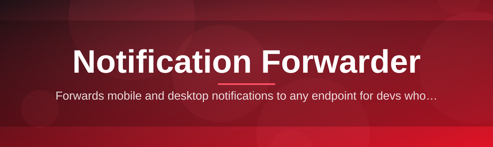
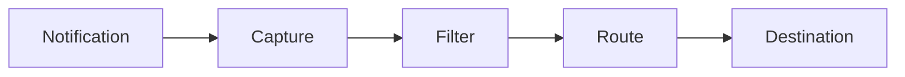

# notification-forwarder-controller 🔔🚀

  

*One tray app. Every toast, everywhere you actually look.*

  

## 🧭 Overview

notification-forwarder-controller is a small, opinionated Windows tray application that takes system and app notifications and reroutes them wherever you're actually paying attention — a phone, a webhook, a second monitor, a log file, whatever. It was built solo, shipped fast, and kept lean on purpose: no background telemetry, no bloated settings tree six menus deep, no "sign in to continue." You open it, you point it at a destination, it starts forwarding.

The problem it solves is simple and universal: Windows notifications are excellent at appearing and terrible at persisting. Miss the five-second toast and it's gone into Action Center purgatory. A notification forwarder closes that gap by intercepting the notification pipeline the moment it fires and pushing a copy out through a channel you control — push endpoint, webhook, local relay, or a lightweight desktop overlay that doesn't vanish until you say so.

This tool is for people running headless builds, multi-machine setups, home labs, or just anyone tired of alt-tabbing back to a machine to check if a long job finished. If you've ever wished your build server, your download client, or your backup script could just *tell* you directly, this is that wire.

## ⚡ Get Started

---

## 🛠️ What It Actually Does

| Capability | The Angle |
|---|---|
| **Live Notification Interception** | Hooks into the Windows notification stream as it fires — not a polling loop, not a screen-scrape. Real-time capture, near-zero lag. |
| **Multi-Destination Routing** | One notification, many exits. Fan it out to a webhook, a relay server, and a local log simultaneously, each with its own filter rules. |
| **Per-App Rule Engine** | Mute Spotify, forward Slack, escalate anything from your CI tool. Rules are matched by source app, keyword, or priority tag. |
| **Zero-Dependency Standalone Binary** | No runtime to install, no framework to babysit. It's one executable and it just runs. |
| **Quiet Hours & Priority Overrides** | Silence the noise at night while still letting "server down" alerts punch through. Configurable per rule. |
| **History & Replay** | Every forwarded notification is logged locally so you can replay it if the destination missed it — no notification left behind. |
| **Lightweight Tray Footprint** | Sits in the system tray sipping resources. No hidden services, no scheduled tasks spawning in the background. |
| **Portable Config Profiles** | Export your routing setup as a single file, drop it on another machine, done. Fleet setups take minutes, not hours. |

> [!TIP]
> Start with one destination and one rule. The rule engine gets powerful fast, but the fastest way to trust the tool is to see a single notification land correctly first.

### Up and Running

1. Hit the download button above — it drops you on the project landing page.

2. Grab the latest standalone build for Windows 10/11, no installer wizard nonsense.

3. Run the executable — it lands in your system tray, no admin elevation required for basic forwarding.

4. Open the tray icon, add your first destination (webhook URL, relay address, or local log), and send a test notification to confirm the pipe is live.

> [!NOTE]
> First launch creates a local config folder next to the executable. Nothing is written outside that folder — portable by default.

---

## 💻 System Requirements

   

- Windows 10 (64-bit) or Windows 11

- No .NET redistributables, no runtimes, no third-party services to provision

- Roughly 40MB of disk space, negligible RAM footprint while idle in the tray

- Outbound network access only if you're forwarding to a remote destination — local-only setups need nothing external

---

## 🔩 How It Works

The forwarding pipeline is intentionally short — fewer hops means fewer places for a notification to get lost.

1. **Capture** — the controller taps into the Windows notification stream as toasts are raised.

2. **Filter** — each notification passes through your per-app and keyword rules to decide relevance.

3. **Route** — matched notifications are packaged and sent to every destination assigned to that rule.

4. **Confirm** — a delivery receipt (or failure) is written to local history for replay if needed.

> [!IMPORTANT]
> Filtering happens before routing, not after. If a notification never matches a rule, it's never sent anywhere — silence is the default, not the exception.

---

## 🧯 Troubleshooting

<strong>My notifications aren't showing up at the destination.</strong>

Check that a rule actually matches the source app — unmatched notifications are dropped silently by design. Open the history panel to confirm whether the notification was even captured.

<strong>The tray icon disappeared after a Windows update.</strong>

Windows sometimes resets tray visibility settings after cumulative updates. Re-pin the icon from the hidden icons tray, or relaunch the executable — no reconfiguration needed, your rules persist.

<strong>Webhook destination shows "delivery failed."</strong>

Usually a timeout or an unreachable endpoint. Check the destination URL is reachable from that machine, and confirm outbound traffic isn't blocked by a firewall profile.

<strong>Can I forward to more than one destination from the same app?</strong>

Yes — assign multiple destinations to the same rule. Each fires independently, so one failing doesn't block the others.

<strong>Does this read the content of encrypted or private notifications?</strong>

It only reads what Windows itself exposes through the standard notification API — nothing more, nothing decrypted or intercepted at a lower level.

<strong>Quiet hours aren't muting anything.</strong>

Quiet hours suppress by priority tier, not blanket-mute everything. Confirm the notifications you expect muted aren't tagged as high priority overrides.

---

## 🎨 UI / UX Notes

> [!NOTE]
> The interface is deliberately minimal — a tray icon, a rules panel, and a history view. No dashboards you need a tutorial for.

- **Keyboard shortcuts:** `Ctrl+Shift+N` opens the quick-rule creator from anywhere; `Ctrl+Shift+H` pulls up recent history; `Esc` closes any open panel.

- **Themes:** Light, Dark, and an Auto mode that follows your Windows theme setting.

- **Settings persistence:** All settings live in a single portable config file — copy it, back it up, version it, your call.

- **Notification history view:** Scrollable, searchable, filterable by app or destination, with one-click replay.

---

## 🤝 Contributing & Community

This started as a solo project and stays fast-moving because of it, but issues, feature requests, and pull requests are genuinely welcome. If you've got a destination integration in mind, a rule-engine idea, or found a rough edge — open an issue.

> [!TIP]
> Small, focused pull requests get reviewed fastest. If you're proposing a bigger change to the routing engine, open an issue first so we can align before you write code.

Star the repo if it saves you from checking a machine you didn't need to walk over to.

---

## 📄 License

Released under the [MIT License](LICENSE), 2026. Use it, fork it, ship it inside your own tools — just keep the license notice intact.

---

## ⚠️ Disclaimer

notification-forwarder-controller is provided as-is, with no warranty of any kind. It forwards notifications based on the rules you configure — it is your responsibility to ensure destinations, webhooks, and endpoints you route sensitive notifications to are trusted and secure. The maintainer is not responsible for data sent to third-party destinations you configure.

> [!WARNING]
> If you route notifications containing sensitive information (2FA codes, private messages, etc.) to an external webhook, that data leaves your machine. Choose destinations you trust.

